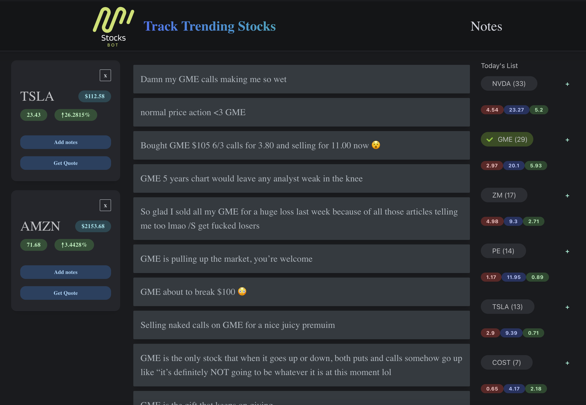

# stocksbot 
Web-app that tracks the popularity and sentiment of the stocks the user is interested in from the subreddit WSB.  Users can create their own list of stocks they want to track and take notes. When they select the stock, they can also see all the post related to that stock and the sentiment scores of the selected stock, and check the quotes.



&nbsp;
# Tech stack
- Frontend: Javascript React, Typescrypt, Mantine
- Backend: Python Django
- REST API: Reddit, Finnhub

&nbsp;
# Feature
1. List all the trending stocks with the number of time they are mentioned 
2. Show sentiment scores of each stock
3. Add each stock to user list
4. Get quotes for the stocks in the user list
5. Add notes for the stocks in the user list

&nbsp;
# Instruction

## Starting the backend server

In the `backend` folder, reate a virtual environment called `.venv`
```shell
>$ python -m venv .venv
```

Activate virual environment 
```shell
>$ source .venv/bin/activate
```

Install all packages needed for the backend (should take a while)
```shell
>$ pip install -r requirements.txt
```

> Note: if this error shows up: Could not build wheels for scipy which use PEP 517 and cannot be installed directly, try updating your pip and install packages again 
```shell
>$ pip3 install --upgrade pip
```

create database
```shell
>$ createdb stocksbot
```

make migrations
```shell
>$ python manage.py migrate
```

Start server
```shell
>$ python manage.py runserver
```

&nbsp;
## Starting the frontend server
Go to `frontend/stocksbot` and install modules from package.json
```shell
>$ npm install 
```

Start the fronend server
```shell
>$ npm start
```

&nbsp;
## Stop server
Enter `Ctrl` + `c` to end server

To deactivate the virtual environment, enter the following command
```shell
>$ deactivate
```

